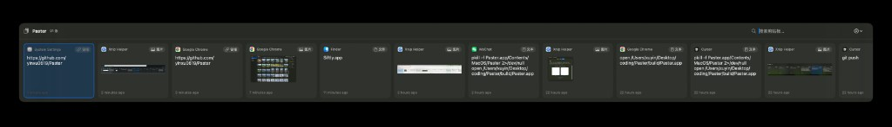
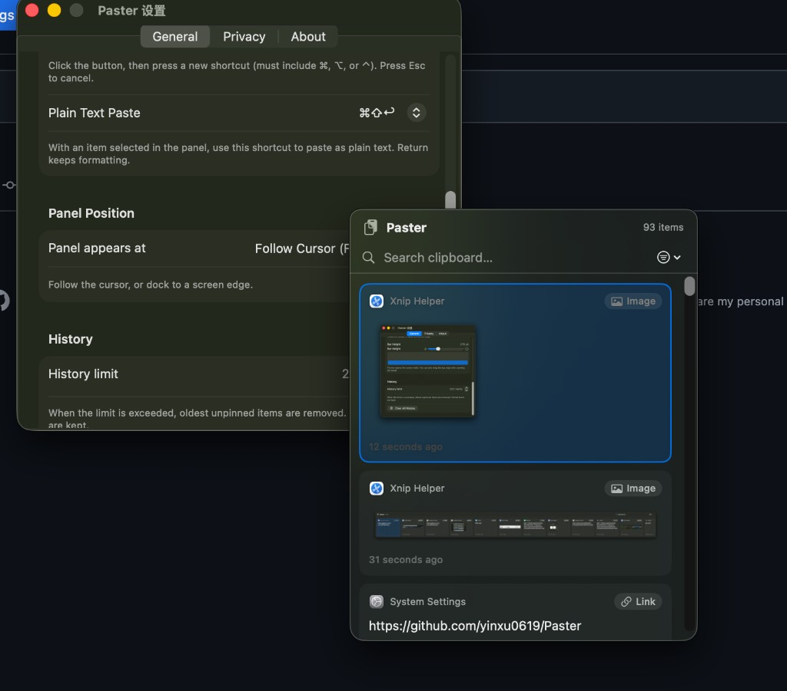
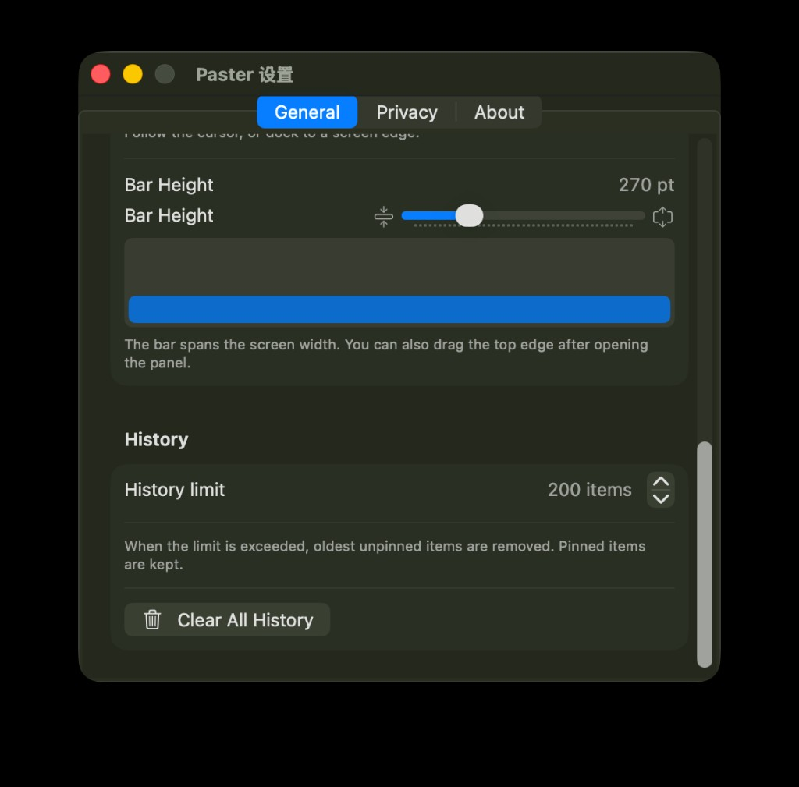

# Paster — macOS / Windows 原生剪贴板管理工具

[English README](README.md)

一款原生剪贴板历史工具。后台实时记录剪贴板，全局热键呼出面板，支持文本 / 富文本 / 图片 / 文件 / 链接，本地存储、不联网。

提供 macOS 原生版（Swift / SwiftUI）与 Windows 11 原生版（C# / WinUI 3），两端交互保持一致。Windows 端说明见 [`windows/README.md`](windows/README.md)。

> 本工程通过多轮增量迭代完成：V1.x 为 macOS 端并持续打磨，V2.0 新增 Windows 11 原生端。代码全部基于上一轮成果扩展，未推翻重写。

## 下载

可直接下载预编译版本：[最新 Release](https://github.com/yinxu0619/Paster/releases/latest)

### macOS 14.0+

1. 下载 `Paster.zip` 并解压
2. 将 `Paster.app` 拖入「应用程序」文件夹
3. 首次打开若被系统拦截，在终端执行：`xattr -d com.apple.quarantine /Applications/Paster.app`
4. 在 **系统设置 → 隐私与安全性 → 辅助功能** 中授权 Paster（自动粘贴需要此权限）
5. 应用以**菜单栏图标**常驻（无 Dock 图标），点击图标或按 `⌘⇧V` 呼出面板

### Windows 11

1. 下载 `Paster-Windows-x64.zip`，整个文件夹一起解压（请勿只取 exe，需保持文件完整）
2. 直接运行 `Paster.Windows.exe` — 无需安装，已是自包含版本
3. 由于未做代码签名，SmartScreen 可能提示风险：选择「**更多信息 → 仍要运行**」
4. 应用以**系统托盘图标**常驻（无任务栏窗口），按 `Alt+C` 呼出面板，或左键点击托盘图标
5. 退出方式：右键托盘图标 → 「**退出 Paster**」

## Windows 自动构建

进入 [Actions → Windows build](https://github.com/yinxu0619/Paster/actions/workflows/windows-build.yml)，
选择成功的构建，在 **Artifacts** 中下载 **Paster-Windows-x64**（需登录 GitHub）。
完整解压 ZIP 后运行 `Paster.Windows.exe`，无需自行安装 .NET。

修改 Windows 代码并推送到 `main`、提交相关 PR 时会自动构建，也支持点击 **Run workflow** 手动触发。
流程包括回归测试、完整 WinUI 编译、自包含打包和启动检查。构建包保留 30 天，不会自动发布到 Releases。

## 截图

**演示动图** — 横向平铺条实际操作（滚动、选择、粘贴）：

<p align="center">
  
</p>

**横向平铺条** — 停靠屏幕边缘的全宽面板，卡片展示预览、来源应用图标与类型标签：

<p align="center">
  
</p>

**设置与悬浮面板** — 可自定义热键、呼出位置、无格式粘贴快捷键与历史上限：

<p align="center">
  
</p>

**横向条高度预览** — 通过滑块调节横向条高度，并实时预览效果：

<p align="center">
  
</p>

## 功能特性

- **剪贴板历史持久化**：后台监听系统剪贴板，自动记录纯文本、富文本、图片、文件路径、URL；每条附带类型标签、时间戳、来源应用名称与图标；数据 100% 本地（SwiftData），不联网、不上传。
- **全局热键呼出**：默认 `⌘⇧V`，任意应用内呼出面板；**可在设置中自定义热键**；失焦自动隐藏，`Esc` 或再次按热键关闭。
- **呼出位置可选**：跟随光标悬浮、屏幕底部 / 顶部 / 左侧 / 右侧 / 中央，均带从对应边缘滑入的动画。
  - 选「底部 / 顶部」时为**全宽横向平铺条**，从屏幕边缘升起；横向条高度可通过**设置里的滑块（带可视化预览）**或**直接拖拽面板上边缘**调整，卡片内容随高度自适应放大；横向条内可用**鼠标滚轮 / 触控板左右切换选中项**。
  - 选「左侧 / 右侧」时为**占满屏幕高度的竖向侧栏**。
- **多模式粘贴**：保留原格式粘贴、纯文本粘贴（剥离格式）、重新复制；卡片右键菜单与键盘操作；**无格式粘贴快捷键可在设置中切换**（默认 `⌘⇧↩`）。
- **搜索与分类**：顶部实时关键词搜索、来源应用筛选；Pin 固定独立分组（Pinboard）置顶。
- **键盘全操作**：`↑↓`（横向条为 `←→`）选择、`Home`/`End` 跳到首/尾、回车粘贴、`⌘⇧↩` 无格式粘贴、`⌘⌫` 删除、`⌘P` 固定、`⌘Y` 全屏预览、`Esc` 关闭，呼出后搜索框自动聚焦。
- **隐私与配置**：排除应用列表（敏感应用不记录）、历史留存数量上限、一键清空、开机自启、菜单栏常驻。
- **体验**：卡片式布局、图片缩略图、悬停 / 选中动效、呼出滑入 / 升起动画、深色 / 浅色与多屏适配。
- **关于页**：应用简介与赞赏码（微信 / 支付宝 / PayPal）。
- **多语言**：简体中文 / English，可在设置中切换或跟随系统语言。

## 技术栈

macOS：

| 项 | 选型 |
| --- | --- |
| 语言 | Swift 5+ |
| UI | SwiftUI 为主，AppKit 辅助（全局热键、剪贴板监听、状态栏、NSPanel） |
| 存储 | SwiftData（本地） |
| 架构 | MVVM 分层 |
| 最低系统 | macOS 14.0 |

Windows（详见 [`windows/README.md`](windows/README.md)）：

| 项 | 选型 |
| --- | --- |
| 语言 | C# / .NET 8 |
| UI | WinUI 3（Windows App SDK），非打包桌面应用 |
| 原生互操作 | `RegisterHotKey`、`AddClipboardFormatListener`、`Shell_NotifyIcon`、`SendInput` |
| 存储 | SQLite（本地） |
| 架构 | MVVM 分层 |
| 最低系统 | Windows 11（Windows 10 21H2 或更新版本大概率可用） |

## 工程结构

```
Paster/
  App/         PasterApp.swift（入口）, AppDelegate.swift（状态栏/热键/面板/预览/设置）
  Models/      ClipboardItem.swift（@Model）, ClipboardItemType.swift, PanelPosition.swift,
               PlainPasteShortcut.swift, AppLanguage.swift
  Services/    PersistenceManager.swift, ClipboardMonitor.swift, HotKeyManager.swift,
               PasteService.swift, AppSettings.swift
  ViewModels/  ClipboardViewModel.swift, SettingsViewModel.swift
  Views/       PanelRootView.swift, ClipboardCardView.swift, SearchBarView.swift,
               SettingsView.swift, PreviewView.swift, AboutView.swift, HotKeyRecorder.swift
  Window/      FloatingPanel.swift（NSPanel）
  Utilities/   ImageUtils.swift, AppIconProvider.swift, KeyCodeTranslator.swift,
               Localization.swift
  Resources/   Assets.xcassets, Paster.entitlements, Paster.icns, Donate/（赞赏码）,
               zh-Hans.lproj/ en.lproj/（本地化）
scripts/       build_check.sh（编译/类型检查校验）, build_app.sh（手动打包 .app）,
               make_icon.swift / make_icns.swift（图标生成）
```

## 数据流

```
NSPasteboard --changeCount 轮询--> ClipboardMonitor --写入--> SwiftData
                                                              |
HotKey(⌘⇧V) --呼出--> FloatingPanel --PanelRootView(@Query)<--+
                                          |
                       回车/双击 --> 隐藏面板 -> 激活目标应用 -> PasteService 模拟 ⌘V
```

## 编译与运行

环境：macOS 14.0+，Xcode 16+。

1. 双击打开 `Paster.xcodeproj`。
2. 选择 `Paster` scheme，`⌘R` 运行。
3. 首次运行需授权：
   - **辅助功能**（系统设置 → 隐私与安全性 → 辅助功能）：用于模拟 `⌘V` 粘贴。
   - 应用以菜单栏图标常驻（无 Dock 图标），点击图标或按 `⌘⇧V` 呼出面板。

> 注意：每次重新打包（ad-hoc 签名会变化）后，系统可能要求**重新授权辅助功能**。若列表里已有旧的 Paster，请先移除再重新添加新的一份，否则模拟 `⌘V` 会被系统静默忽略（表现为只替换了剪贴板但没粘贴进去）。

### 命令行校验

```bash
bash scripts/build_check.sh
```

脚本优先调用 `xcodebuild` 完整构建；若当前机器的 Xcode 命令行工具异常（插件 / 私有框架损坏），自动回退到带 SwiftData 宏插件的 `swiftc -typecheck`，对全部源码做完整类型检查（含宏展开）。

### 打包为 .app

```bash
bash scripts/build_app.sh
```

直接用 `swiftc` 编译全部源码、组装 `build/Paster.app`（嵌入图标与赞赏码、ad-hoc 签名）并产出 `build/Paster.zip`。若图标在 Finder 未刷新，执行：

```bash
touch build/Paster.app && killall Finder Dock
```

## 快捷键

| 操作 | 快捷键 |
| --- | --- |
| 呼出 / 隐藏面板 | `⌘⇧V`（可自定义） |
| 关闭面板 | `Esc` |
| 选择 | `↑` / `↓`（横向条 `←` / `→`，或鼠标滚轮 / 触控板） |
| 跳到首 / 尾 | `Home` / `End` |
| 粘贴选中项（保留格式） | `回车` |
| 无格式粘贴 | `⌘⇧↩`（可在设置中切换） |
| 删除选中项 | `Delete` / `⌘⌫` |
| 固定 / 取消固定 | `⌘P` |
| 全屏预览 | `⌘Y` |
| 打开设置 | `⌘,` |

## 隐私说明

所有剪贴板数据仅保存在本机 SwiftData 存储中，应用不发起任何网络请求。可在设置中将密码管理器等敏感应用加入排除列表，其复制内容不会被记录。

## 赞赏支持

如果觉得好用，欢迎请作者喝杯咖啡 ☕️

<table>
  <tr>
    <td align="center"><br/>微信支付</td>
    <td align="center"><br/>支付宝</td>
  </tr>
</table>

或通过 [PayPal](https://www.paypal.com/paypalme/yinxu0619) 支持。

## 路线图

- V1.0 – V1.2：macOS 原生版（Swift / SwiftUI / SwiftData）。
- V2.0：Windows 11 原生版（C# / WinUI 3 / SQLite），位于 [`windows/`](windows/) 目录，对齐 macOS 端核心功能与交互。

## License

MIT
